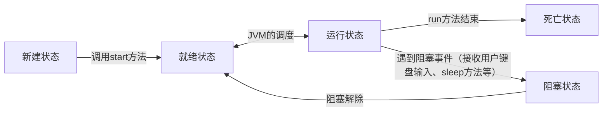

[toc]

**承前启后**

注意到，以上 2 种方式： 继承 Thread 类+重写它的 run 方法 创建实现了 Runnable 接口的类+重写它的 run 方法

### 线程的 5 种状态

**新建**状态就当做出生 ，**死亡**状态顾名思义就是死亡 **就绪、执行、阻塞**

一个生命周期大致是：1.新建状态->2.就绪状态与死亡状态交替->3.死亡状态



### 就绪状态

处于**新建状态**的线程，调用 start 方法后进入**就绪状态**

> 新建状态：刚 new 出来的线程对象（这个状态就无所谓）

**就绪状态**也叫可运行状态： 当前线程具有抢夺 CPU 时间片的权利

> CPU 时间片就是 CPU 执行权

> 计算机将**存储**(Storage)、**算术逻辑单元**(Arithmetic Logic Unit)和**控制单元**(Control Unit)三个部分合称为中央处理器（CPU），再加上**输入设备**(Input Devices)和**输出设备**(Output Devices)就组成了计算机硬件系统。

寄存器属于 CPU 的**存储**部分。寄存器是一种非常快速的临时存储器件

### 运行状态

> 回忆：传说中“就绪状态与死亡状态交替”，表现为：主线程和分支线程打印顺序有先有后；连续的打印有多有少

run 方法执行，则线程进入**运行状态**

run 方法的开始执行标志着这个线程进入运行状态

如果 CPU 时间片用完了，但 run 方法没有执行完，线程不会死亡，而是返回就绪状态，继续抢夺 CPU 时间片

当再次抢到 CPU 时间之后，会重新进入 run 方法接着上一次的代码继续往下执行。

伪代码：

```java
while(run方法没有执行完){
    while(CPU时间片没有用完){
        线程进入运行状态，执行run方法，消耗自己占用的CPU时间片
    }
    while(CPU时间片没有了&&CPU时间片没有抢到){
        线程返回就绪状态，给自己抢CPU时间片
    }
}
```

简单地说： 有心急的猴子。在没填饱肚子的情况下，它有 2 个反射： 如果手头有香蕉，直接吃香蕉，而不去找香蕉 如果手头没香蕉，会去找香蕉，得到若干香蕉就开吃。

注意，谁抢到是随机的。一小段执行状态完了回到就绪状态，接着还能抢到，接着执行！

这是“有多有少”的原因之一！

> 拓展：java 的线程调度模型属于“抢占式”。一些语言的线程调度模型属于“均分式”，这些语言对 CPU 时间片是平均分配的

> 在锁池当中的等待不是 5 种状态以外的状态，最接近的是其中的**阻塞状态**
