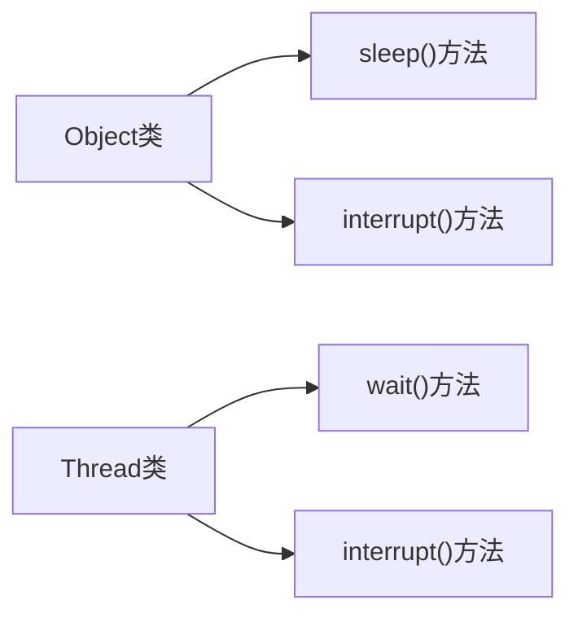

### wait 和 notify 是属于 Object 类的方法

> 众所周知，Object 是祖宗类，Thread 类理所应当可以用 Object 类的方法



sleep()方法有 1 个参数：毫秒时间，wait 是无限期等待

### 作用

**对线程的效果**

```java
    Object obj = bew  Object();
    obj.wait();
    ...
    obj.notify()
```

调用`wait()`方法的线程，立刻进入无限期等待

直到 `notify()`把进入了无限等待的线程唤醒

**对象 o 调用 wait 方法，在对象 o 上面活动的线程 t 进入等待状态**，并且线程 t 释放占用的 对象 o 的锁

**对象 o 调用 notify 方法，唤醒正在对象 o 上的等待的线程**，并不释放 对象 o 被占用的 的锁

如果所有线程都在等待相同的条件，并且一次只有一个线程可以从条件变为 true，则可以使用 notify over notifyAll。 在这种情况下，notify 是优于 notifyAll 因为唤醒所有这些因为我们知道只有一个线程会受益而所有其他线程将再次等待，没必要 notifyAll 方法

### 要与线程同步机制配合

**wait 和 notify 通常并不用来做线程同步** 如果要实现生产者-消费者模型，wait 和 notify 反而是要和线程同步机制配合！
