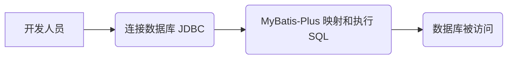
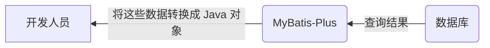
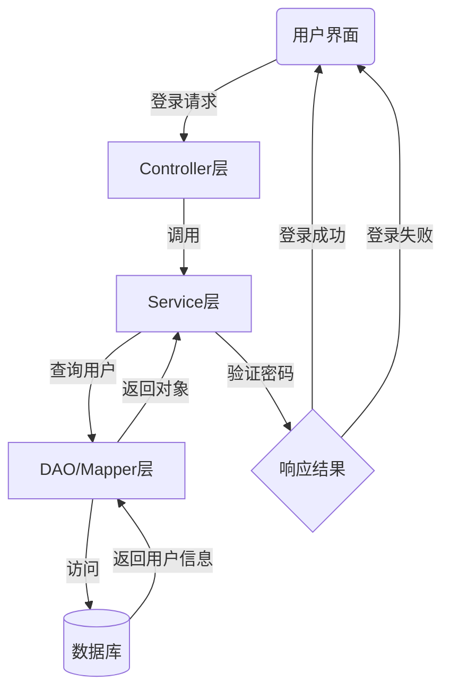

[TOC]

[BotBattle项目完整代码](https://github.com/xiu1zi3/Bot-Battle) DAO模式的pojo, dao, service, controller 四层以及JDBC、MyBatis-Plus插件

### 访问数据库流程

- **连接数据库**
  JDBC（Java 数据库连接）发送 SQL 语句到数据库。

- **MyBatis-Plus 映射，数据库执行 SQL**
  MyBatis-Plus 把数据库的数据映射成 Java 对象，通过简单的 Java 方法调用，代替手写 SQL 代码。

### DAO模式

通俗的例子 ：

> Controller 层像是一个服务员，他把客人（前端）点的菜（数据、请求的类型等）进行汇总什么口味、咸淡、量的多少，交给厨师长（Service 层），厨师长则告诉沾板厨师（Dao 1）、汤料房（Dao 2）、配菜厨师（Dao 3）等（统称 Dao 层）我需要什么样的半成品，副厨们（Dao 层）就负责完成厨师长（Service）交代的任务。

#### 4 层

- pojo （Plain Old Java Object）层：在各层之间传输数据。将数据库中的表对应成 Java 中的 Class。比如封装用户信息。

- dao（Data Access Object）层（也叫 mapper 层）：将 pojo 层的 class 中的操作（CRUD），映射成 sql 语句。与数据库交互，比如获取或更新用户数据。

- service 层：组合使用 mapper 层 中的操作，实现具体的业务逻辑，如验证登录。

- controller 层：接收请求，返回请求数据，是用户与系统交互的入口。具体地说，负责请求转发，接受前端页面过来的参数，传给相应 Service 处理，接到返回值，再传给页面。

| class 操作 | 数据库操作 |
| :--------: | :--------: |
|   Create   |   insert   |
|  Retrieve  |   select   |

剩下的 2 个操作：Update 对应 update，Delete 对应 delete

#### 对象的调用流程

#### 耦合性与分层

> 如果一个厨师既负责跑堂，又负责烹饪。那这个饭店的管理一定非常混乱吧。小工就是 DAO，从食材库里（数据源）取出食材（原始数据），进行简单处理（数据对象化）。厨师就是 Service，找到小工（DAO），获取各种半成品（对象化数据），加工成顾客需要的菜肴（最终数据）。跑堂就是 Controller，负责接单（提交数据）上菜（响应数据），是顾客与后厨间的媒介（提供用户与后台程序的接口）。各司其职（高内聚），轻松协作（低耦合），就是分层思想的目标。

这个通俗易懂的故事从该链接转载：[https://blog.csdn.net/qq_41810415/article/details/126545376](https://blog.csdn.net/qq_41810415/article/details/126545376)
